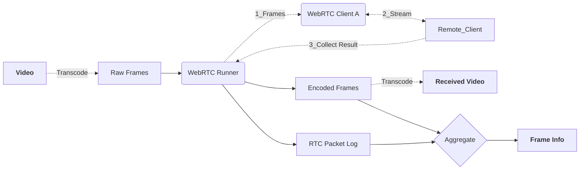

# webrtc-experiment-conductor

Pile of scripts to automate DF video generation, P2P video streaming experiment, trace collections, and post-processing.

- Orchestrate P2P WebRTC streaming experiment over two hosts
- Customized WebRTC native client
- Collect WebRTC packet logs and video dump
- Parse and format results for analysis

## Note

**Code hidden during submission**

## Instructions

The whole pipeline is controlled by a single yaml config file, for example: `config.yaml`
